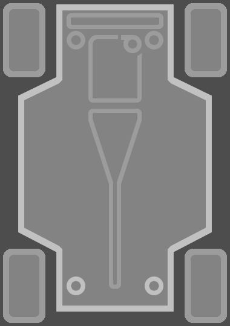
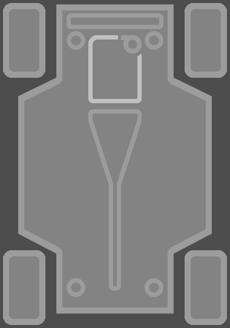

# Damage UI

A mod for Art of Rally that adds special UI to display the damage state of the car.

#### Launcher Support

#### Platform Support

## Usage

Press Ctrl + F10 to open the mod manager menu.\
Adjust settings to select the colors you want for the UI, its placement and its size.\

By default, the mod places the UI on the bottom left of the screen with green to red UI colors.

### Support

The game does not support car damage in Freeroam mode.
All other game modes should be supported by this mod.

### Settings

- **goodColor** : will set the color of the parts in a good state.\
- **badColor** : will set the color of the parts in a bad state.\
- **xPositionPercent** : will move the UI horizontally.\
- **yPositionPercent** : will move the UI vertically.\
- **uiScale** : will change the size of the UI.

Disabling the mod in the manager will hide the UI by default.

### Car parts

#### Body

#### Wheels

#### Radiator

#### Suspensions

#### Engine

#### Turbo

#### Transmission

### Available colors

The available colors for the UI are :

- White
- Grey
- Black
- Red
- Green
- Blue
- Yellow
- Magenta
- Cyan
- Brown

## Known issues

The UI might not show on start of race.

A possible fix is to change the **uiScale** while in a race (any gamemode other than Freeroam).\
Another fix would be to open and close the pause menu.

## Installation

Follow the [installation guide](https://www.nexusmods.com/site/mods/21/) of
the Unity Mod Manager.\
Then simply download the [latest release](https://www.nexusmods.com/artofrally/mods/12)
and drop it into the mod manager's mods page.

## Showcase

